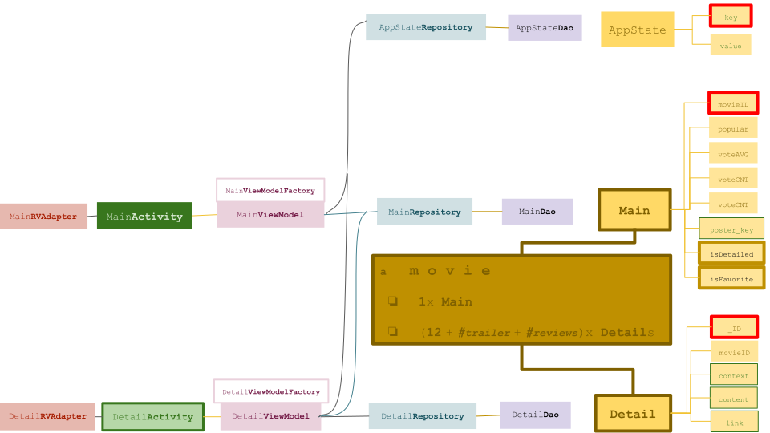

# ud801: Popular Movies

&nbsp;&nbsp;

The here presented solution devides all data associated with a particular movie *(using www.moviedb.org)* into:
- one __Main__
- multiple __Detail__ s

each is stored separately within its own table.
There is a third kind of data having its own table, and not related to any movie, but to the users interactions, called __AppState__, containing only simple key-value pairs.

&nbsp;&nbsp;

The __Main__ only contains:
- ___movieID___ , an INTEGER
- ___popular___ , a DOUBLE denoting the popularity
- ___voteAVG___ , a DOUBLE  denoting the vote average
- ___voteCNT___ , an INTEGER denoting the vote count
- ___posterID___ , a STRING, presuming with no more than 32 chars

as well as the following user interaction specifics:
- ___isFavorite___ , a BOOLEAN flag denoting the users attitude towards the movie
- ___hasDetails___ , a BOOLEAN flag denoting if the user has already been there, and therefore is accessible in offline case

*(both, initially set to FALSE)*

For a rough estimate of the worst case scenario, presuming a granularity of 8 bytes (6 * 8 bytes =  48 bytes), and for the STRING: 32 x (2 bytes) = 64 bytes, gives __112__ bytes total.
Furthermore, presuming about __12 000__ movies gives a little over one mega bytes (1 344 000 bytes) plus some overhead -- definitely no more than __1.5 mb__ .

This is why initially, a background thread is started, downloading the Mains of all movies accessible *(using both, www.moviedb.org 's  ___popular___ and ___top_rated___ requests.)*

&nbsp;&nbsp;

Each __Detail__ contains:
- ____ID___
- ___movieID___
- ___context___ , a STRING, denoting the slot it is presented *(see below)*
- ___content___ , a STRING, denotation context-sensitive
- ___link___ , a STRING, denoting a link fragment, whereas its counterpart is context-dependent

the __context__ is indexed in the following sense:

0. ___title___,
1. ___original_title___,
2. ___original_language___,
3. ___release_date___,
4. ___runtime___,
5. ___tagline___,
6. ___overview___,
7. ___genres___,
8. ___budget___,
9. ___revenue___,
10. ___homepage___,
11. ___imdb_id___,
12. ___videos___,
13. ___reviews___

as it is the order it is presented within the __DetailActivity__.
*(Note, that if 0. and 1. are the same, 1. and 2. are omitted.)*
Since the __Detail__ s are not needed within the __MainActivity__ they are only downloaded as the user enters the __DetailActivity__
and only those associated with that particular movie, that is presented.

&nbsp;&nbsp;

In trying to familiarize myself with design principle *(e.g.: MVVM, Repositories, ...)* the following
architecture is chosen:

